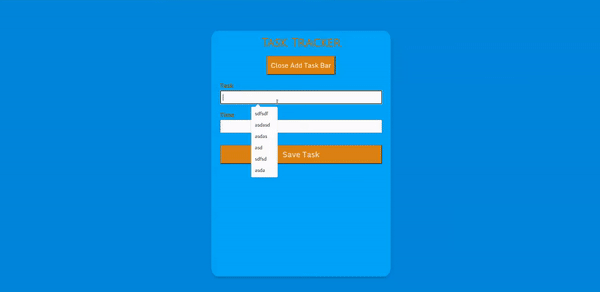

<p align="center">
<a href="https://www.linkedin.com/in/ahmet-ayd%C4%B1n-2583b1199/" target="_blank"></a>
</p>


# Project : Employee List
## Table of contents

  - [The challenge](#the-challenge)
  - [Screenshot](#screenshot)
  - [Project Skeleton ](#project-skeleton)
  - [Links](#links)
  - [Built with](#built-with)
  - [Useful resources](#useful-resources)
- [Author](#author)


## The challenge
The aim of this project is to create a task tracker.


## Project Skeleton 

```

|----README.md                   
|----components
     |--App
     |--Tasks


```

## Screenshot
<p align="center">
<a href="https://phenomenal-figolla-7920ab.netlify.app/"></a>
</p>


## Links
<hr>
<b>Check The Live Website ➡️</b> <a href="https://phenomenal-figolla-7920ab.netlify.app/">Live Website</a>
<hr>

### Built with
- React
- jsx
## Notes


### Useful resources

- [W3 Schoold](https://www.w3schools.com/) - This helped me for basics of website paradigm. I really liked this pattern and will use it going forward.
- [MDN](https://developer.mozilla.org/en-US/) - This is an amazing document which helped me finally understand deep sides of web development. I'd recommend it to anyone still learning these concepts.


## Author

- Author - [Ahmet]

<center> &#8987; Happy Coding  &#9997; </center>

